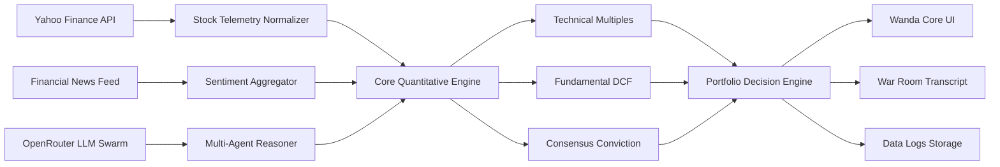
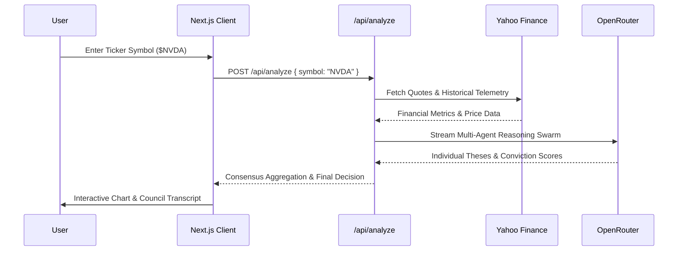

# Chatie Agent | Wanda AI Core Terminal


> **Chatie Agent** is a multi-agent equity research terminal and consensus engine that runs a panel of investor-model agents across live market data, identifying where they agree and where they disagree.

---

## 📌 Table of Contents

- [Overview](#overview)
- [Key Features](#key-features)
  - [1. Landing Page Consensus Terminal (`/`)](#1-landing-page-consensus-terminal-)
  - [2. Wanda AI Quantitative Dashboard (`/dashboard`)](#2-wanda-ai-quantitative-dashboard-dashboard)
- [Multi-Agent Swarm Philosophy](#multi-agent-swarm-philosophy)
- [Technical Architecture](#technical-architecture)
  - [Data Pipeline Architecture](#data-pipeline-architecture)
  - [Workflow Sequence](#workflow-sequence)
- [Tech Stack](#tech-stack)
- [Getting Started](#getting-started)
  - [Prerequisites](#prerequisites)
  - [Installation & Setup](#installation--setup)
- [Responsive Design](#responsive-design)
- [Project Structure](#project-structure)
- [License & Disclaimer](#license--disclaimer)

---

## Overview

**Chatie Agent** brings institutional-grade multi-agent equity analysis to users through two synchronized interfaces:
1. **The Consensus Engine Landing Page**: Explores disagreement spreads, itemized dissents, 6 institutional datasets, telemetry distributions, and streaming API endpoints.
2. **Wanda AI Core Terminal Dashboard**: A Bloomberg-grade execution workspace featuring real-time tickers, sentiment gauges, CLI command analysis, war room committee debates, and coverage data logs.

---

## Key Features

### 1. Landing Page Consensus Terminal (`/`)
- **19 Independent Mandates**: Value, growth, macro, and tail-risk agents reason simultaneously without seeing each other's outputs.
- **Itemized Dissent Spread**: Pinpoints the exact line items (e.g. forward CAGR, margin durability, attach rates) driving divergence.
- **Verified Dataset Explorer**: 6 linked financial datasets:
  - Sector-specific operational KPIs
  - Historical 30+ year income statements
  - Balance sheets and capital structures
  - Cash flow statements (operating, CapEx, free cash flow)
  - Verbatim section-level SEC 10-K / 10-Q excerpts
  - Real-time Form 4 insider transaction feeds
- **Telemetry & Latency Visualizer**: Live bull-bear spreads and consensus conviction charts.
- **Developer API Panel**: Interactive endpoint generator with Python, TypeScript, and cURL snippets.
- **Human / Machine Mode Toggle**: Switch between visual presentation and machine-readable JSON formats.

### 2. Wanda AI Quantitative Dashboard (`/dashboard`)
- **System Overview**: Hero status indicator, live market ticker cards (SPY, QQQ, AAPL, NVDA) with sparklines, Fear & Greed Index Gauge, and financial news stream.
- **Wanda Core Terminal**: Interactive CLI prompt bar (`$ <TICKER>`), multi-stage quantitative pipeline telemetry, intrinsic valuations, and price charts.
- **Council Discussion (War Room)**: Live multi-agent debate transcript featuring committee members (Cathie Wood, Michael Burry, Aswath Damodaran, Stanley Druckenmiller, Nassim Taleb, etc.).
- **Data Logs**: High-density dataset table with dynamic valuation multiples (P/E, PEG), market cap formatting, and pagination.
- **Configuration**: OpenRouter API Key management, parameter persistence, and system identity diagnostics.

---

## Multi-Agent Swarm Philosophy

The panel runs specialized agent models, each embodying distinct investment frameworks:

| Agent Profile | Core Philosophy & Methodology |
| :--- | :--- |
| **Aswath Damodaran** | Valuation fundamentals, narrative-to-numbers cash flow DCF. |
| **Ben Graham** | Deep value, margin of safety, net-current-asset value. |
| **Bill Ackman** | Concentrated activist value with high operational leverage. |
| **Cathie Wood** | Exponential technological innovation and disruptive platforms. |
| **Charlie Munger** | Quality businesses with strong moats and pricing power. |
| **Michael Burry** | Contrarian deep value, macroeconomic imbalances, tail risks. |
| **Mohnish Pabrai** | Low-risk, high-uncertainty Dhandho framework. |
| **Nassim Taleb** | Antifragility, fat-tailed risk distributions, convexity. |
| **Stanley Druckenmiller** | Macro top-down trends and liquidity-driven inflection points. |
| **Warren Buffett** | Durable competitive moats, compounding cash generation. |

---

## Technical Architecture

### Data Pipeline Architecture



### Workflow Sequence



---

## Tech Stack

- **Framework:** [Next.js 16 (App Router)](https://nextjs.org/) with Turbopack
- **Language:** [TypeScript 5](https://www.typescriptlang.org/)
- **Styling:** Vanilla CSS Custom Design Systems + Tailwind CSS Utilities
- **Typography:** Geist Sans & Geist Mono fonts
- **Charts:** [Recharts](https://recharts.org/) & Custom SVG Telemetry Engines
- **AI Intelligence:** [OpenRouter API](https://openrouter.ai/) (Multi-Agent Swarm)
- **Market Data:** [Yahoo Finance API](https://finance.yahoo.com/)

---

## Getting Started

### Prerequisites

- [Node.js](https://nodejs.org/) 18.18+ or 20+
- [pnpm](https://pnpm.io/) (or npm / yarn)
- OpenRouter API Key (available at [openrouter.ai/keys](https://openrouter.ai/keys))

### Installation & Setup

1. **Clone the Repository:**
   ```bash
   git clone https://github.com/bimoadis/ChatieAgent.git
   cd ChatieAgent
   ```

2. **Install Dependencies:**
   ```bash
   pnpm install
   ```

3. **Configure Environment:**
   Create a `.env.local` file in the root directory:
   ```env
   OPENROUTER_API_KEY=sk-or-v1-your-openrouter-key-here
   ```

4. **Run Development Server:**
   ```bash
   pnpm dev
   ```

5. Open [http://localhost:3000](http://localhost:3000) for the landing page or [http://localhost:3000/dashboard](http://localhost:3000/dashboard) for the terminal.

---

## Responsive Design

Both the Landing Page and Dashboard are engineered with responsive layouts supporting:
- **Mobile (< 640px)**: Compact navigation drawer, full-width touch actions, and single-column cards.
- **Tablet (640px - 1024px)**: 2-column data grids, horizontal swipeable dataset tabs, and sliding sidebar drawer.
- **Laptop & Desktop (1024px+)**: Full multi-column split views, fixed telemetry rail, and high-density financial terminal layout.

---

## Project Structure

```
ChatieAgent/
├── public/
│   ├── banner.png          # Project banner
│   ├── logo.png            # Application logo
│   └── logos/              # Company ticker logo assets
├── src/
│   ├── app/
│   │   ├── api/            # API Route handlers (analyze, discussion, stock)
│   │   ├── dashboard/      # Wanda AI Dashboard page
│   │   ├── dashboard.css   # Dashboard design system styles
│   │   ├── globals.css     # Global landing page styles & tokens
│   │   ├── layout.tsx      # Root layout & favicon config
│   │   └── page.tsx        # Chatie Agent landing page
│   ├── components/
│   │   ├── landing/        # Landing page components (AgentDemo, DatasetTerminal, etc.)
│   │   ├── Sidebar.tsx     # Dashboard sidebar & mobile drawer
│   │   ├── DashboardView.tsx # System overview, tickers & gauge
│   │   ├── StockAnalyzer.tsx # Wanda Core CLI & analysis
│   │   ├── AgentDiscussion.tsx # War room council transcript
│   │   ├── History.tsx     # Coverage data logs table
│   │   └── Settings.tsx    # Configuration & API settings
│   ├── lib/
│   │   ├── openrouter.ts   # Multi-agent prompt orchestrator
│   │   ├── yahoo-finance.ts# Market quote and chart fetcher
│   │   └── landing-data.ts # Telemetry datasets & mock data
│   └── types/
│       └── index.ts        # TypeScript schemas & interfaces
├── package.json
└── README.md
```

---

## License & Disclaimer

This project is licensed under the [MIT License](LICENSE).

**Disclaimer:** *Chatie Agent and Wanda AI are designed strictly for educational and research purposes. The multi-agent models generate output based on public financial data and do not provide licensed financial, investment, tax, or legal advice.*
